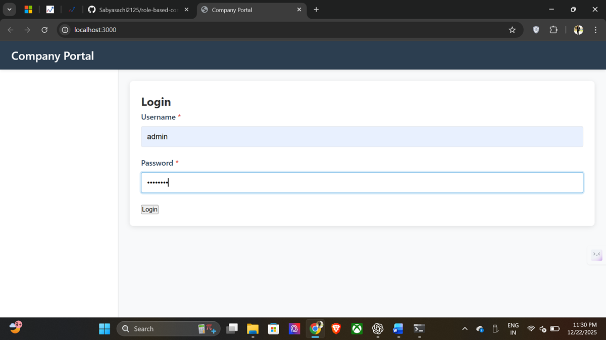
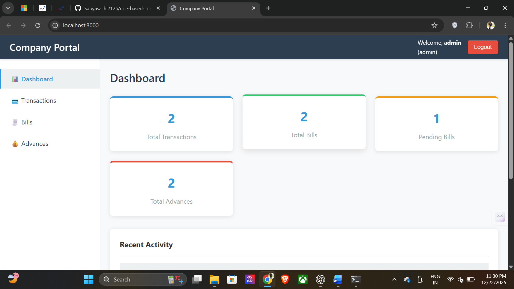
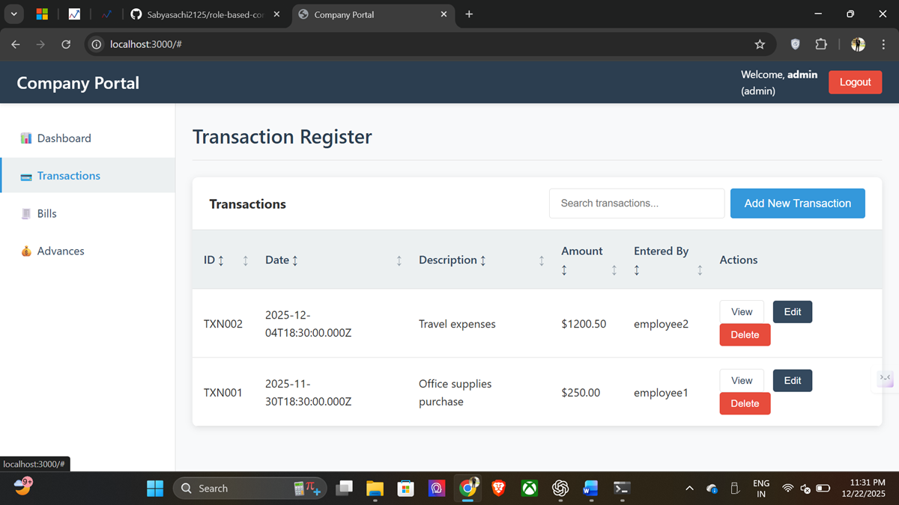
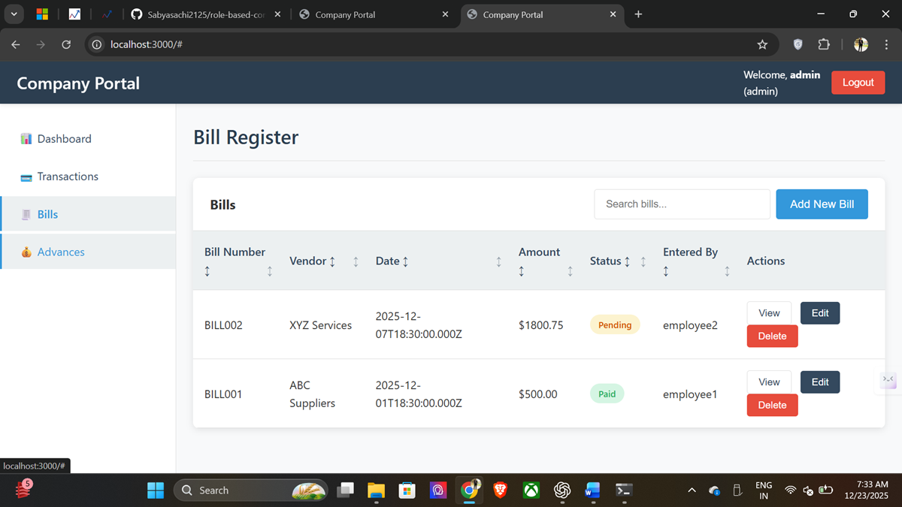
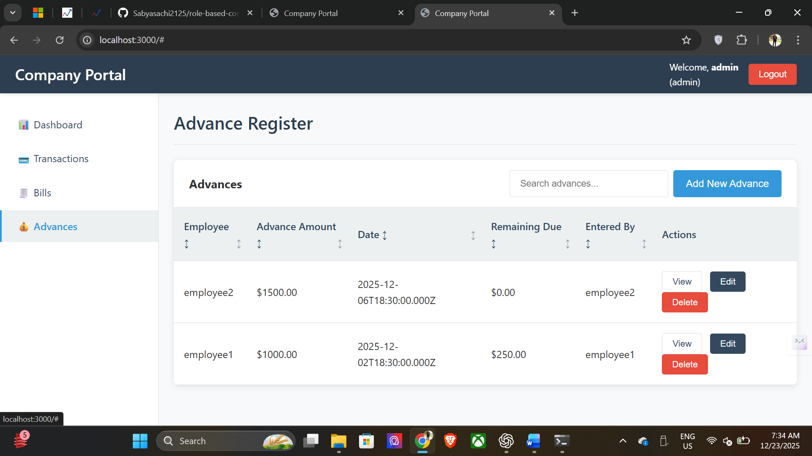
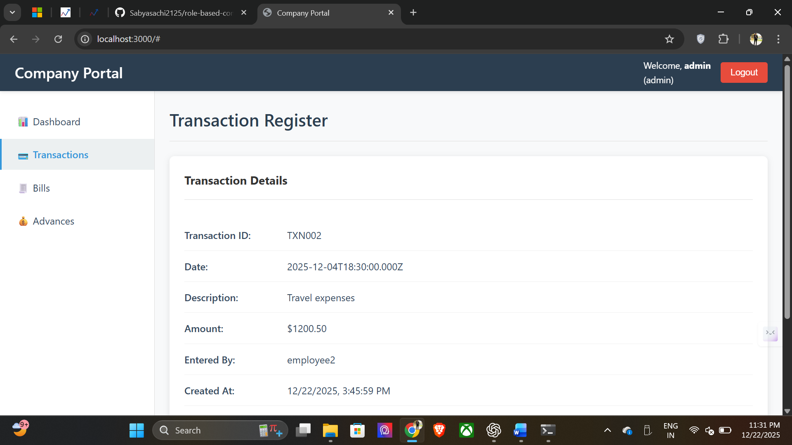
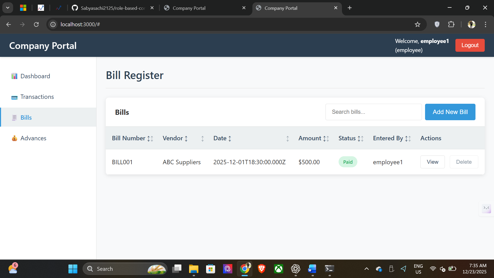
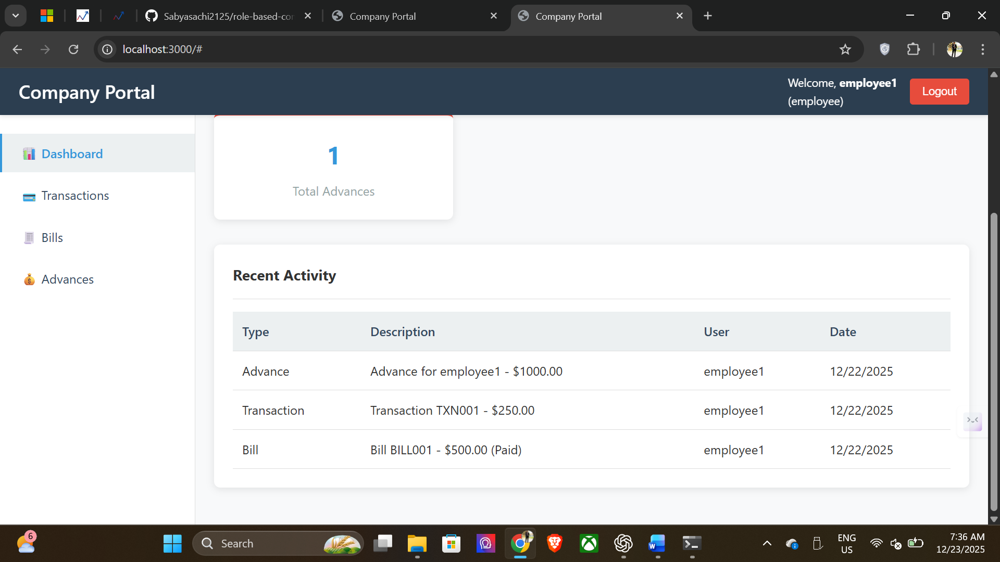

🏢 Role-Based Company Portal
A production-ready internal company portal designed to replace Excel-based financial record management with a secure, role-based web application.
The system supports Admin and Employee roles, enforces backend-level RBAC, and ensures real-time data consistency using a centralized database.
________________________________________
🚀 Key Features

👑 Admin
•	Full CRUD access to:
o	Transactions
o	Bills
o	Employee Advances
•	Edit and update records with immediate reflection for employees
•	Dashboard with summary insights
•	Backend-enforced role permissions
•	Secure session management

👤 Employee
•	Add new records
•	View own transactions, bills, and advances
•	Read-only access to sensitive data
•	Restricted from editing or deleting records
________________________________________
🔐 Security & Access Control
•	Session-based authentication
•	Password hashing using bcrypt
•	Backend-enforced Role-Based Access Control (RBAC)
•	SQL injection prevention via parameterized queries
•	Environment-based configuration (.env)
•	Single source of truth via MySQL database
________________________________________
🛠 Tech Stack
Frontend
•	HTML5
•	CSS3
•	Vanilla JavaScript
Backend
•	Node.js
•	Express.js
Database
•	MySQL
Authentication
•	express-session
•	bcrypt
________________________________________
📁 Project Structure
company-portal/
├── backend/
│   ├── config/
│   ├── controllers/
│   ├── middleware/
│   ├── models/
│   ├── routes/
│   ├── app.js
│   └── server.js
├── frontend/
│   ├── css/
│   ├── js/
│   └── index.html
├── database/
│   └── schema.sql
├── .env.example
├── .gitignore
├── README.md
├── package.json
└── requirements.txt
________________________________________
⚙️ Setup Instructions
1️⃣ Clone Repository
git clone https://github.com/Sabyasachi2125/role-based-company-portal.git
cd role-based-company-portal
________________________________________
2️⃣ Database Setup
CREATE DATABASE company_portal;
Import schema:
mysql -u root -p company_portal < database/schema.sql
________________________________________
3️⃣ Environment Configuration
Create a .env file inside backend/:
PORT=3000
DB_HOST=localhost
DB_USER=root
DB_PASSWORD=your_mysql_password
DB_NAME=company_portal
SESSION_SECRET=your_secret_key
________________________________________
4️⃣ Install Dependencies & Run Server
cd backend
npm install
npm start
________________________________________
5️⃣ Access Application
http://localhost:3000
________________________________________
🧪 Functional Highlights
•	Admin edits are instantly reflected in employee views
•	Employees are restricted at API level
•	UI adapts dynamically based on role
•	Toast notifications and loading states for better UX
•	Clean, enterprise-style dashboard layout
________________________________________
##📸 Screenshots

### 🔐 Login Page

### 👑 Admin Dashboard

### 📊 Transactions Management

### Bill Management

### Employee advance Management

### 👀 View Record

### ✏️ Edit Record

### 👤 Employee View (Read-Only)

### Recent Activity

________________________________________
🎯 Use Case
Designed for internal company use to manage:
•	Financial transactions
•	Vendor bills
•	Employee advances
Ideal replacement for Excel-based workflows with better security, traceability, and usability.
________________________________________
🧠 What This Project Demonstrates
•	Real-world backend RBAC implementation
•	Secure session handling
•	Clean MVC architecture
•	Database-driven consistency
•	Professional UX polish
•	Production-ready project structuring
________________________________________
📌 Future Enhancements (Optional)
•	Audit log viewer (Admin)
•	CSV / Excel export
•	Pagination at database level
•	Deployment (Render / Railway / VPS)
________________________________________
🏁 Final Note
This project was built with a real-world internal application mindset, focusing on security, data integrity, and usability rather than just CRUD functionality.
________________________________________
⭐ If you like this project, feel free to ⭐ the repository!
________________________________________
